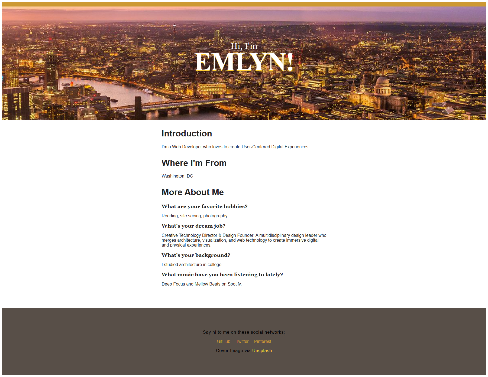

# About Me – Personal Portfolio Website



## 🌐 Live Website
👉 https://edaviesc.github.io/aboutme/

---

## 📌 Project Overview

This is a responsive **personal portfolio webpage** built to introduce who I am, my background, interests, and professional aspirations. The website presents a clean layout with a strong visual hero section and clearly structured content sections.

The goal of this project was to create a simple, elegant, and readable personal profile page using foundational front-end technologies.

---

## 🎯 Features

- Full-width hero section with background cityscape image  
- Clean typography and centered layout  
- Introduction and personal background section  
- Hobbies and interests  
- Career aspirations  
- Social media links in the footer  
- Simple and responsive structure  

---

## 🛠️ Technologies Used

- HTML5  
- CSS3  
- Responsive Layout Techniques  

---

## 🧠 Content Sections

### Introduction
Brief professional summary as a Web Developer focused on creating user-centered digital experiences.

### Where I'm From
Location information (Washington, DC).

### More About Me
- Favorite hobbies  
- Dream job and career vision  
- Educational background  
- Music preferences  

---

## 🎨 Design Highlights

- Large hero banner with overlay text  
- Clear content hierarchy  
- Neutral color palette  
- Structured spacing for readability  
- Minimal and distraction-free layout  

---

## 📂 Project Structure

```plaintext
aboutme/
│
├── index.html
├── style.css
├── aboutme.jpg
└── README.md

---

## 🚀 Purpose of This Project

This project demonstrates:

- Clean semantic HTML structure  
- Basic layout styling with CSS  
- Personal branding through web design  
- Ability to deploy using GitHub Pages  

---

## 📬 Connect With Me

- GitHub  
- Twitter  
- Pinterest  

---

## 📄 License

This project is open-source and available for learning and educational purposes.
